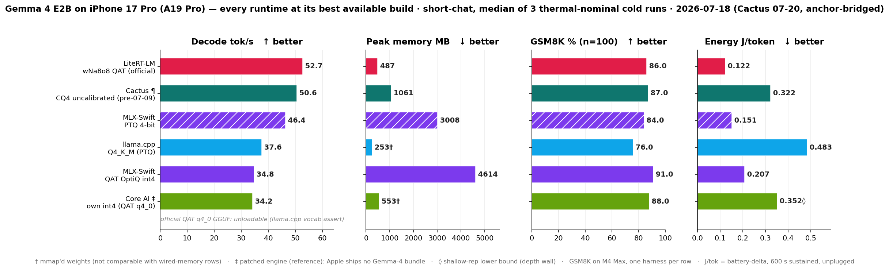
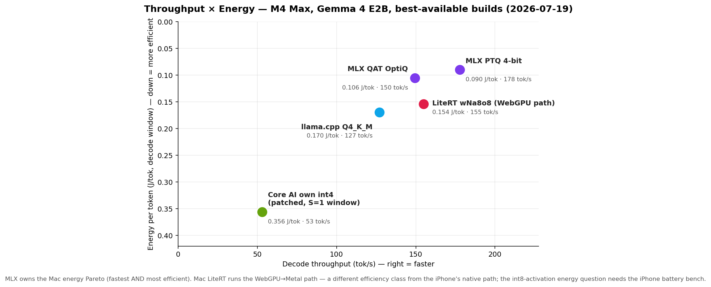
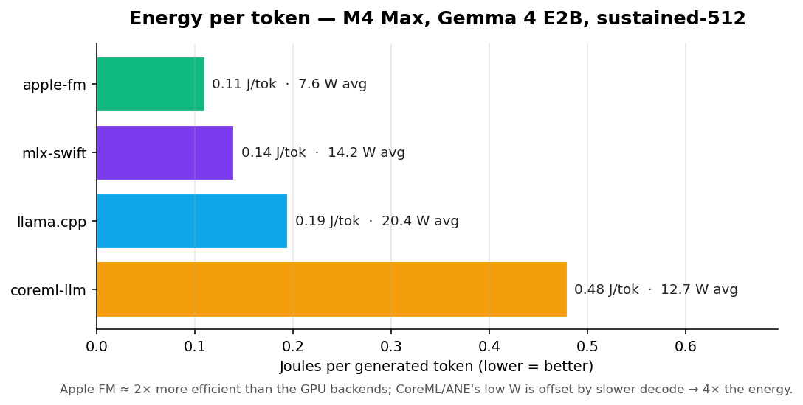

# Apple Silicon LLM Benchmark

<!-- BEGIN GENERATED: scripts/render_headline.py -->

**Decode tok/s, batch 1, greedy.** Generated from stored records by `scripts/render_headline.py` (newest record 2026-09-05) — do not edit inside the markers. Full standings with prefill, TTFT, memory and GSM8K: [LEADERBOARD.md](LEADERBOARD.md); every capture: [RESULTS.md](RESULTS.md) and `results/`. No cross-cell ratios are printed here on purpose: cells are compared only within one session, and the session is part of every cell.

**Harness cells** — task `short-chat` (same prompt and 128-token budget for every arm, in-tree harness, per-run JSONL under `results/raw/`). **Bold** = warm, the median of one session's in-process runs (run 1 of every launch dropped as cold); "cold" = fresh-process first generation, shown where a session has no warm runs. Only runs that started thermal-nominal count ([fairness-rules §2](methodology/fairness-rules.md)), and each cell is its newest qualifying session — the date in parentheses. Several artifacts of one runtime are listed fastest-first, never pooled.

| Model | Device | Apple Core AI | MLX | LiteRT-LM | Core ML |
|---|---|---:|---:|---:|---:|
| Qwen 3 0.6B ¹ | iPhone 17 Pro | 193.3 cold `qwen3-0.6b-gpu` (2026-06-18)<br>**122.4** `qwen3-0.6b-ane-june` (2026-07-13)<br>**116.9** `qwen3-0.6b-ane` (2026-07-13) | **178.8** (2026-08-26) | **122.1** (2026-08-26) | 37.7 cold (2026-06-17) |
| Qwen 3 0.6B | Mac Studio (M4 Max) | — | **555.9** (2026-08-17) | **309.9** (2026-08-17) | — |
| Qwen 3 8B | Mac Studio (M4 Max) | — | 98.3 cold (2026-06-17) | 62.4 cold (2026-06-17) | — |

¹ Qwen 3 0.6B · iPhone 17 Pro: the cells come from 5 capture sessions (Apple Core AI 2026-06-18 and 2026-07-13 (`2026-07-14-iphone-final`); MLX 2026-08-26 (`2026-08-26-iphone-lfm-pair`); LiteRT-LM 2026-08-26 (`2026-08-26-iphone-qwen-3runtime-pair`); Core ML 2026-06-17). Same device, different sittings — device state moves between sessions (measured on the phone: `results/raw/2026-07-13-mlx-variance/`), so a ratio between two cells of this row is not a measurement; compare within one session (the dated tables below are per-session).

<details><summary>Recipes behind the harness cells (quant-per-arm-rule)</summary>

- iPhone 17 Pro · Qwen 3 0.6B · Apple Core AI: `core-ai/qwen3-0.6b-gpu` — INT4 (dynamic), engine pre-stamp, cold, 3 fresh-process launches in that session (no warm runs), last one shown, session 2026-06-18; newer capture on 2026-08-26 started hot and did not qualify (thermal guard)
- iPhone 17 Pro · Qwen 3 0.6B · Apple Core AI: `core-ai/qwen3-0.6b-ane` — 4-bit palettized (uniform g32), engine pre-stamp, warm median of 3 in-process runs, session 2026-07-13 (`2026-07-14-iphone-final`)
- iPhone 17 Pro · Qwen 3 0.6B · Apple Core AI: `core-ai/qwen3-0.6b-ane-june` — mixed 4/8-bit (June static export), engine pre-stamp, warm median of 3 in-process runs, session 2026-07-13 (`2026-07-14-iphone-final`)
- iPhone 17 Pro · Qwen 3 0.6B · MLX: `mlx-community/Qwen3-0.6B-4bit` — Q4, engine 60bd0d7880c82980f9481f8be78862e9b63c58a3, warm median of 2 in-process runs, session 2026-08-26 (`2026-08-26-iphone-lfm-pair`)
- iPhone 17 Pro · Qwen 3 0.6B · LiteRT-LM: `litert-community/Qwen3-0.6B` — INT4 (mixed, blockwise gs32), engine v0.16.0, warm median of 3 in-process runs, session 2026-08-26 (`2026-08-26-iphone-qwen-3runtime-pair`)
- iPhone 17 Pro · Qwen 3 0.6B · Core ML: `coreml-llm/qwen3-0.6b` — INT8 palettized, engine pre-stamp, cold, 1 fresh-process launch in that session (no warm runs), last one shown, session 2026-06-17
- Mac Studio (M4 Max) · Qwen 3 0.6B · MLX: `mlx-community/Qwen3-0.6B-4bit` — Q4, engine 60bd0d7880c82980f9481f8be78862e9b63c58a3, warm median of 2 in-process runs, session 2026-08-17 (`2026-08-17-mac-litert-v0160`)
- Mac Studio (M4 Max) · Qwen 3 0.6B · LiteRT-LM: `litert-community/Qwen3-0.6B` — INT4 (mixed, blockwise gs32), engine v0.16.0, warm median of 3 in-process runs, session 2026-08-17 (`2026-08-17-mac-litert-v0160`)
- Mac Studio (M4 Max) · Qwen 3 8B · MLX: `mlx-community/Qwen3-8B-4bit` — Q4, engine pre-stamp, cold, 3 fresh-process launches in that session (no warm runs), last one shown, session 2026-06-17
- Mac Studio (M4 Max) · Qwen 3 8B · LiteRT-LM: `litert-community/Qwen3-8B` — INT4 (mixed, blockwise gs32), engine pre-stamp, cold, 3 fresh-process launches in that session (no warm runs), last one shown, session 2026-06-17

</details>

**Apple `llm-benchmark` protocol, Mac** — 512-token prompt, 1024 generated, 5 trials, greedy; Apple Core AI = Apple's `llm-benchmark` release build, MLX = `mlx_lm benchmark` with the same arguments. A different budget from the harness rows above (budget-mode-rule): never compare a number here with one there. Each cell is its newest campaign — the date in parentheses.

| Model | Device | Apple Core AI | MLX |
|---|---|---:|---:|
| Qwen 3 0.6B ¹ | Mac Studio (M4 Max) | 503.1 (2026-07-13) | 432.3 (2026-06-11) |
| Qwen 3 8B | Mac Studio (M4 Max) | 94.1 (2026-06-11) | 90.0 (2026-06-11) |

¹ Qwen 3 0.6B · Mac Studio (M4 Max): the cells come from 2 capture sessions (Apple Core AI 2026-07-13 (`2026-07-13-mac-warm/coreai-ct041`); MLX 2026-06-11 (`2026-06-11-m4max-coreai-matrix`)). Same device, different sittings — device state moves between sessions (measured on the phone: `results/raw/2026-07-13-mlx-variance/`), so a ratio between two cells of this row is not a measurement; compare within one session (the dated tables below are per-session).

<details><summary>Recipes behind the llm-benchmark cells</summary>

- Mac Studio (M4 Max) · Qwen 3 0.6B · Apple Core AI: `qwen3_0_6b_dynamic_ct041` — Apple `llm-benchmark`, 512p/1024g, mean of 5 trials (trial spread 0.1%), `results/raw/2026-07-13-mac-warm/coreai-ct041/`
- Mac Studio (M4 Max) · Qwen 3 0.6B · MLX: `mlx-community/Qwen3-0.6B-4bit` — `mlx_lm benchmark` (mlx-lm 0.31.3), same 512p/1024g/5 arguments, mean of the trials, `results/raw/2026-06-11-m4max-coreai-matrix/mlx_sweep_0.31.3.log`
- Mac Studio (M4 Max) · Qwen 3 8B · Apple Core AI: `qwen3_8b_4bit_dynamic` — Apple `llm-benchmark`, 512p/1024g, mean of 5 trials (trial spread 0.3%), `results/raw/2026-06-11-m4max-coreai-matrix/`
- Mac Studio (M4 Max) · Qwen 3 8B · MLX: `mlx-community/Qwen3-8B-4bit` — `mlx_lm benchmark` (mlx-lm 0.31.3), same 512p/1024g/5 arguments, mean of the trials, `results/raw/2026-06-11-m4max-coreai-matrix/mlx_sweep_0.31.3.log`

</details>

**Hybrid Mamba-2 / Transformer models, CLI runs** — llama.cpp = `llama-bench` tg256 (pp512 prompt), MLX = `mlx_lm generate` 256 tokens; greedy, batch 1, mains power, one machine. Quantization is **not** equal across columns (Q4_K_M is not 4-bit affine — see the recipes and the caveats in each report); ‡ = the report records a coherence problem with that output. Reports: `results/hybrid/hybrid-apple-silicon-bench-2.json`, `results/hybrid/nemotron3-nano-apple-silicon-bench.json`.

| Model | Device | MLX | llama.cpp | Measured |
|---|---|---:|---:|---|
| NVIDIA Nemotron-3 Nano 30B-A3B | Apple M4 Max | 159.7 | 86.2 | 2026-09-04 |
| NVIDIA Nemotron-3 Nano 4B | Apple M4 Max | 176.8 | 88.4 | 2026-09-04 |
| IBM Granite-4.0-H-Tiny | Apple M4 Max | 202.2 | 117.3 | 2026-09-04 |
| Granite-4.0-H 350M | Apple M4 Max | 521.7 | 282.5 | 2026-09-05 |
| Granite-4.0-H 1B | Apple M4 Max | 275.8 | 141.9 | 2026-09-05 |
| Falcon-H1 1.5B-Instruct | Apple M4 Max | 300.0 ‡ | 147.5 | 2026-09-05 |
| Falcon-H1 3B-Instruct | Apple M4 Max | 167.9 ‡ | 86.4 | 2026-09-05 |
| Falcon-H1 7B-Instruct | Apple M4 Max | — | 52.7 | 2026-09-05 |

<details><summary>Recipes behind the hybrid cells</summary>

- NVIDIA Nemotron-3 Nano 30B-A3B · MLX: mlx-community/NVIDIA-Nemotron-3-Nano-30B-A3B-4bit 4-bit (mlx-community) (mlx 0.32.2, mlx-lm 0.31.3; 256 tokens, median of 3 processes)
- NVIDIA Nemotron-3 Nano 30B-A3B · llama.cpp: unsloth/Nemotron-3-Nano-30B-A3B-GGUF Q4_K_M (Homebrew build 8680, commit 15f786e65; tg256 mean of 3 (±0.47))
- NVIDIA Nemotron-3 Nano 4B · MLX: mlx-community/NVIDIA-Nemotron-3-Nano-4B-4bit 4-bit (mlx-community) (mlx 0.32.2, mlx-lm 0.31.3; 256 tokens, median of 3 processes)
- NVIDIA Nemotron-3 Nano 4B · llama.cpp: nvidia/NVIDIA-Nemotron-3-Nano-4B-GGUF Q4_K_M (Homebrew build 8680, commit 15f786e65; tg256 mean of 3 (±0.22))
- IBM Granite-4.0-H-Tiny · MLX: lmstudio-community/granite-4.0-h-tiny-MLX-4bit 4-bit affine, group_size 64, MoE router layers 8-bit (from config.json) (mlx 0.32.2, mlx-lm 0.31.3; 244 tokens (EOS before 256), median of 3 processes)
- IBM Granite-4.0-H-Tiny · llama.cpp: unsloth/granite-4.0-h-tiny-GGUF Q4_K_M (Homebrew build 8680, commit 15f786e65; tg256 mean of 3 (±0.92))
- Granite-4.0-H 350M · MLX: mlx-community/granite-4.0-h-350m-4bit rev 2b96c1f6 (mlx 0.32.2, mlx-lm 0.31.3; 256-token generation, median of 3 processes)
- Granite-4.0-H 350M · llama.cpp: ibm-granite/granite-4.0-h-350m-GGUF Q4_K_M rev a864f823 (llama.cpp build 8680 Homebrew; tg256 mean of 3 (±1.38))
- Granite-4.0-H 1B · MLX: mlx-community/granite-4.0-h-1b-4bit rev a5a21e23 (mlx 0.32.2, mlx-lm 0.31.3; 256-token generation, median of 3 processes)
- Granite-4.0-H 1B · llama.cpp: ibm-granite/granite-4.0-h-1b-GGUF Q4_K_M rev c2cb1972 (llama.cpp build 8680 Homebrew; tg256 mean of 3 (±1.69))
- Falcon-H1 1.5B-Instruct · MLX: mlx-community/Falcon-H1-1.5B-Instruct-4bit rev 6f5e4f68 (mlx 0.32.2, mlx-lm 0.31.3; 256-token generation, median of 3 processes) — ‡ degenerates into repetition after ~2 sentences on the long prompt
- Falcon-H1 1.5B-Instruct · llama.cpp: tiiuae/Falcon-H1-1.5B-Instruct-GGUF Q4_K_M rev 0d3a6cfe (llama.cpp build 8680 Homebrew; tg256 mean of 3 (±0.87))
- Falcon-H1 3B-Instruct · MLX: own 4-bit gs64 affine from tiiuae bf16 rev 01087ec4 with mlx-lm 0.31.3 (4.504 bpw) (mlx 0.32.2, mlx-lm 0.31.3; 256-token generation, median of 3 processes) — ‡ fluent but muddled
- Falcon-H1 3B-Instruct · llama.cpp: own Q4_K_M from tiiuae/Falcon-H1-3B-Instruct bf16 rev 01087ec4 via convert_hf_to_gguf.py (llama.cpp 8680) + llama-quantize, 4.79 BPW (llama.cpp build 8680 Homebrew; tg256 mean of 3 (±0.01))
- Falcon-H1 7B-Instruct · llama.cpp: tiiuae/Falcon-H1-7B-Instruct-GGUF Q4_K_M rev 058c8c8f (llama.cpp build 8680 Homebrew; tg256 mean of 3 (±0.19))

</details>

<!-- END GENERATED: scripts/render_headline.py -->

Not in the generated tables, because this repo holds no record for them: the Apple Core AI numbers for the hybrid models live on the model cards ([`mlboydaisuke/Nemotron-3-Nano-4B-CoreAI`](https://huggingface.co/mlboydaisuke/Nemotron-3-Nano-4B-CoreAI), [`coreai-community/granite-4.0-h-CoreAI`](https://huggingface.co/coreai-community/granite-4.0-h-CoreAI)), and the macOS-26-era Qwen3-0.6B Core AI artifact (the 1,121 tok/s figure in the Core AI section) left only an archived hash, not a benchmark record.

**On-device LLM benchmark for Apple Silicon — iPhone · iPad · Mac.**

A neutral, reproducible benchmark for running local LLMs (and, in time, ASR / TTS) on Apple Silicon. Compares **MLX Swift, llama.cpp, CoreML (swift-transformers), LiteRT-LM, ExecuTorch, ANEMLL, Apple Core AI** — and Apple's own Foundation Models — under real device constraints, not just `tok/s` on a server.

> Repo: `apple-silicon-llm-bench` · CLI/brand: `yardstick`. Started life as `ios-llm-benchmark` — iPhone is still the headline target, now measured alongside iPad and Mac.

---

## ⚡ NEW — Apple **Core AI** benchmarked (the Core ML successor)

[Core AI](https://developer.apple.com/documentation/coreai) is Apple's Core ML successor, announced at WWDC 2026 (iOS / macOS 27). First independent on-device LLM benchmark — vs MLX and CoreML, **same model, same harness**.


**iPhone 17 Pro · Qwen3-0.6B · short-chat · decode tok/s (cold = fresh-process first generation; warm = in-process median of runs 2-4, [fairness-rules §2](methodology/fairness-rules.md)):**

| Engine | Compute | Cold | Warm (r2-4) | Peak RAM | Session |
|---|---|---:|---:|---:|---|
| **Core AI** (pipelined) | GPU | **193.3** 🏆 _(first-ever 76.5)_ | blocked† | 196 MB | 2026-06-18 |
| MLX | GPU | 167.2 | **158.8** | 489 MB | 2026-07-13 |
| **Core AI** (static-shape) | ANE | 143.7 | blocked† | 1,158 MB | 2026-06-18 |
| LiteRT-LM | GPU | 121.0 | 120.4 | 1,384 MB | 2026-07-13 |
| **CoreML-LLM** | ANE | 37.7 | pending‡ | **184** 🏆 | 2026-06-17 |

> **Read the Session column before comparing rows.** Cross-session ratios are invalid on this
> device: the same MLX binary + pins measured 126–133 tok/s in mid-June and 159–180 today
> (device-state change, likely an iOS 27 beta update — full investigation with raw data:
> [`results/raw/2026-07-13-mlx-variance/`](results/raw/2026-07-13-mlx-variance/README.md)).
> Within-June sessions Core AI GPU led MLX (193.3 vs 126–133 cold ≈ **1.5×**); today's
> same-session Release warm gives **LiteRT-LM ≈ 0.76× MLX**. This replaces the earlier
> Debug-contaminated MLX 112 row and the "~1.6× once warm" framing.
>
> † **Core AI warm re-capture was blocked in July**: `coreai-build` aborted on the macOS 27
> beta of the time (both toolchain generations), so the 0.6B bundles could not be re-assembled —
> [`methodology/coreai-build-regression-2026-07.md`](methodology/coreai-build-regression-2026-07.md);
> cold/warm behaviour was re-verified at 4B instead (bundles survive on-device). A warm capture
> of the macOS-26-era GPU bundle exists from 2026-08-26
> ([`results/raw/2026-08-26-iphone-coreai-pairs/`](results/raw/2026-08-26-iphone-coreai-pairs/summary.md):
> 152.3 cold / 147.4 warm, engine 0.2.0+static-inputs-patch), but every cell of that session
> started thermal-fair, so it fails the §2 guard and is not in the tables.
> ‡ CoreML-LLM stateful-chunks bundle needs re-conversion before it can be re-measured.

- **Core AI's GPU "pipelined" engine was the fastest path in the June session** — cold 193.3
  after a one-time first-ever cost (76.5 on the very first generation while the shader/pipeline
  caches build; subsequent fresh processes hit ~194). MLX and LiteRT are flat cold-to-warm.
- **Core AI's compute unit is fixed by the *export shape*, not a runtime flag:** `coreai.llm.export … --platform iOS` (static) is detected as chunked-static → the **ANE**; a dynamic export → the **GPU** pipelined engine. And iOS can't JIT the exported IR — it must be `coreai-build compile`-d to a per-GPU-arch `.aimodelc` first (`No such file or directory` otherwise).
- **CoreML-LLM is the memory champion** — 184 MB, ~6× leaner than Core AI's ANE path — via a stateful INT4 Neural-Engine conversion (own work, 100% ANE residency).
- Faithful to Apple's intended path: official `coreai.llm.export` + the `coreai-models` `CoreAILM` runtime, driven by the in-tree [`CoreAIRuntime`](ios/BenchmarkApp/Sources/Runtimes/CoreAIRuntime.swift). Method + gotchas: [`methodology/coreai-ios.md`](methodology/coreai-ios.md).

**Does the GPU lead hold at scale? (Mac M4 Max, same params)**


| Model (4-bit) | Core AI GPU | MLX | Core AI lead |
|---|---:|---:|---:|
| Qwen3-0.6B (macOS-26 export) | 1,121 | 455 | **2.47×** |
| Qwen3-0.6B (macOS-27β re-export) | ~500 | 455 | **1.1×** |
| Qwen3-8B | 94 | 90 | **1.05×** |

Core AI's pipelined-GPU lead is large on **tiny** models — where its async-dispatch / overlap dominates — but **converges to a near-tie at a realistic 8B**, where both runtimes become memory-bandwidth-bound. _(Matched: 512-token prompt, 512 gen, greedy, warm. Core AI via Apple's `llm-benchmark`; MLX via `mlx_lm`.)_

> ⚠️ **The 0.6B number is export-generation-dependent.** The same `coreai.llm.export`
> recipe produces a 2.2× slower artifact after the macOS 27 beta upgrade (native
> quantized-Linear lowering → explicit dequant ops; same runtime, same code, same
> wheels). Forensics: [`methodology/coreai-export-lowering.md`](methodology/coreai-export-lowering.md).
> Benchmark the artifact you ship.
>
> **Confirmed on iPhone 17 Pro** (both artifacts AOT-compiled `--architecture h18p`,
> GPU, synthetic 512p/1024g — deeper-KV protocol, NOT comparable to the short-chat
> table above): macOS-26 artifact **115.1 tok/s** decode / 5,807 prefill / 0.22 GB
> footprint vs 27β artifact 57.2 / 1,519 / 0.47 GB — **~2× decode, 3.8× prefill,
> half the memory, from the export environment alone.** ANE (official iOS static
> preset, same protocol): 69.6 tok/s, 0.045 s warm load.

**Full official-recipe matrix (M4 Max, macOS 27β artifacts, `llm-benchmark` defaults 512p/1024g/5):**

| Model | Artifact | Core AI decode (prefill) | MLX 0.31.3 decode (prefill) | Decode verdict |
|---|---|---:|---:|---|
| gpt-oss-20b (MoE, MXFP4) | 13 GB | 78.1 (1,252) | **100.2** (1,528) | **MLX +28%** |
| qwen3-0.6b | 335 MB | **484** (9,396) | 432 (9,366) | **Core AI +12%** |
| qwen3-4b | 2.1 GB | 145.4 (**1,635**) | 145.8 (1,495) | tie |
| qwen3-8b | 4.3 GB | **94.1** (912) | 90.0 (825) | **Core AI +5%** |
| gemma3-4b-it | 2.1 GB | **141.5** (1,669) | 136.3 (1,631) | **Core AI +4%** |
| gemma3-12b-it | 6.2 GB | 55.0 (**578**) | 55.1 (528) | tie |
| mistral-7b-v0.3 | 3.8 GB | **101.7** (976) | 97.5 (918) | **Core AI +4%** |

**Core AI matches or beats MLX on every dense model; MLX's one clear win is the MoE**
(expert dispatch, not the core engine). On noise: per-trial σ is ≤0.4% on 6 of 7
models (worst 1.3%) — the dense deltas are 10–30× trial noise with a consistent
direction; cross-machine variance is what independent reproduction tests (welcome —
per-trial JSONs + env pins in `results/raw/`). gpt-oss-20b bonus: `COREAI_CHUNK_THRESHOLD` is a
memory dial — unchunked 4096-token prefill hits 1,439 tok/s (+16%) at 18 GB dirty
footprint, chunk-128 (the `llm-runner` MoE hint) caps memory at 1.7 GB for 766 tok/s.
Raw logs + env pins: [`results/raw/2026-06-11-m4max-coreai-matrix/`](results/raw/2026-06-11-m4max-coreai-matrix/).
**Every bundle measured here is downloadable** (hashes + env stamps on the cards, incl.
the irreproducible macOS-26 0.6B artifact): [HF `<model>-CoreAI-official` repos](https://huggingface.co/mlboydaisuke).

---

## 📱 TL;DR — iPhone 17 Pro (A19 Pro)

Real LLM inference on a phone — on-device, no server. iPhone 17 Pro, short-chat (128 tokens), thermal-nominal. **The winning runtime depends on what you optimize for — speed, memory, or quality.** Gemma rows are the **2026-07-28/30 fairness re-capture** (warm protocol: runs 2–3 median of n≥6 launches, run 1 dropped as cold, ctx forced 2048); per-cell dates and n are stated in the table.

> **2026-07-28/30 fairness re-capture.** Every Gemma comparison below is now like-for-like:
> one warm protocol, one prefill instrument for every arm (a harness bug had discarded
> LiteRT-LM's task-path prefill counters on capped runs — fixed in the r3 harness and proven
> on device), both MLX rows in one session, and memory on the median charged footprint.
> Full records with per-cell n and number-trace audits:
> [`results/raw/2026-07-29-gemma4-e2b-protocol/`](results/raw/2026-07-29-gemma4-e2b-protocol/README.md) (iPhone)
> and [`results/raw/2026-07-28-gemma4-e2b-protocol-mac/`](results/raw/2026-07-28-gemma4-e2b-protocol-mac/README.md) (Mac).
> **Energy re-published on a rebuilt instrument**: the old J/token figures are retired —
> iOS 27's battery gauge reports in 5% steps and start/end deltas swing ×2 between identical
> runs ([evidence](results/raw/2026-07-30-gemma4-e2b-protocol/README.md)). The ◊ column now
> measures between gauge transitions (tick-window, audited); on it **LiteRT leads iPhone
> energy** (LiteRT 0.147 vs MLX 0.182) while the Mac's GPU-only powermetrics basis has MLX first —
> the energy verdict genuinely differs by OS.

### Gemma 4 E2B — every runtime at its best *available* build (2026-07-18 + Cactus 2026-07-20, iOS 27.0)



The earlier version of this table had each arm on a different checkpoint quality class (MLX and llama.cpp on PTQ, LiteRT on QAT) — it measured who had the better checkpoint, not the better runtime. This one states the build per row, the capture session per cell, and adds **GSM8K n=100** (measured on M4 Max with one identical harness for every row — greedy, thinking-off, same extractor). Decode/ITL are the warm protocol; memory is the median charged footprint over the same warm session:

| Runtime | Build | Decode tok/s | ITL p50 | Mem MB (median fp) | GSM8K | J/tok ◊ |
|---|---|---:|---:|---:|---:|---:|
| 🔴 LiteRT-LM | wNa8o8 QAT (official) | **61.1** 🏆 (A2 7/28, n=8) | **16.3 ms** | **497** 🏆 | 86.0% | **0.147** 🏆 ◊ |
| 🌵 Cactus ¶ | CQ4 **uncalibrated** (their pre-07-09 build) | 50.6 (7/20 cold ×3 — warm not re-measured) | 19.6 ms (7/20) | 1,061 (7/20, peak basis) | 87.0% | 0.222 ◊ |
| 🌵 Cactus | **CQ4 as shipped** (`cactus run` default) | 50.0 (C 7/29, n=8) | 19.8 ms | 632 | **3.0%** | 0.226 ◊ |
| 🟣 MLX-Swift | PTQ 4-bit | 49.1 (A2 7/28, n=6) | 20.5 ms | 3,010 | 84.0% | 0.182 ◊ |
| 🍎 Core AI ‡ | own int4 (from official QAT q4_0) | 47.1 (C 7/29, n=8) | 21.4 ms | 755 † | 88.0% | — (structural ◊) |
| 🔵 llama.cpp | Q4_K_M (PTQ) | 38.8 (7/27, n=10) | 24.4 ms (7/27) | 191 † | 76.0% | 0.260 ◊ |
| 🟣 MLX-Swift | QAT OptiQ int4 | 36.0 (A2 7/28, n=6) | 27.9 ms | 4,592 | **91.0%** 🏆 | 0.231 ◊ |
| 🔵 llama.cpp | **official QAT q4_0** | **unloadable** | — | — | — | — |

> ◊ **Tick-window instrument (r4, audited).** iOS 27's battery gauge reports in 5% steps, so start/end deltas swing ×2 between identical runs ([evidence, all 12 retired cells](results/raw/2026-07-30-gemma4-e2b-protocol/README.md)); J/tok here is instead measured **between gauge transitions** (2 complete ticks per cell, transition timestamps in the raw JSONs, nominal-start enforced, unplugged). Steps aren't equidistant, so a cell carries ±~10% — the Cactus-uncal 0.222 / Cactus-shipped 0.226 / MLX-OptiQ 0.231 trio is one **unresolved cluster**; LiteRT < MLX < cluster < llama.cpp are resolved. Core AI is structurally excluded: the equalized per-call budget (2048) exceeds its iOS KV cap (1,024) and the app is jetsammed at setup.
> † mmap'd weights: clean pages aren't charged to `phys_footprint`, so these cells are not comparable with runtimes that wire their weights — llama.cpp's 191 MB hides 2.9 GB of mmap'd GGUF that shows up in residency (3.1 GB). LiteRT-LM is the only arm under a gigabyte on **both** the footprint and resident columns, which is the honest form of the memory claim.
> ‡ **Patched engine (reference)**: Apple ships no Gemma-4 bundle and `EngineOptions.staticInputBuffers` is a local engine patch — but the *path* is Apple's standard `EngineFactory`. Its TTFT is the honest cost of S=1 unbatched prefill (Gemma-4's per-layer embeddings force it).
> ¶ **Cactus row = the build they demoted, because it is their best usable.** On 2026-07-09 Cactus replaced its default CQ4 and renamed the original to `-uncalibrated`. The two are **speed-identical** but the shipped default is reasoning-dead: **GSM8K 3.0%** on the same one-harness protocol, while the demoted build scores **87.0%** — the QAT-class band. Their newer mixed-precision prebuilts (cq3.26/cq2.54) probe at 4%/16% (n=25). Same best-usable rule that puts MLX on OptiQ; the uncalibrated zip is a manual download from the same HF repo. Engine = their Metal GPU default via `cactus_init`/`cactus_complete`, cloud-handoff + telemetry forced off, exact engine-reported token counts. Cross-session ratios go through a same-session LiteRT anchor: at matched conditions Cactus-shipped decodes at **0.84× LiteRT** (block C, 2026-07-29: 50.0 vs 59.4 — re-confirming the 0.83× the 7/20 control measured).

- **The decode+memory upset survives the fairness fix — and now a 7th arm.** LiteRT-LM still beats every loadable arm on decode and every wired-memory arm on footprint (2.2–9.5×). At **matched quality** (LiteRT 86.0 vs MLX-PTQ 84.0) it is 1.14× faster with 6× less memory. **Cactus arrives as the clear #2 on decode** — at matched same-session conditions it runs 0.83× LiteRT's rate (¶, anchor-adjusted) at *higher* GSM8K (87.0 vs 86.0), paying 2.2× the memory and 2.6× the energy.
- **Quality still goes to MLX-OptiQ: 91.0%** — +5 pts over the wNa8o8 build LiteRT ships, at 0.66× its decode. No runtime is Pareto-dominant once quality is on the table: **speed/memory/energy → LiteRT-LM, quality → MLX-OptiQ, balance → Core AI or Cactus-uncalibrated** (Cactus: 0.83× LiteRT's decode at +1 GSM8K pt; Core AI: +2 pts at 0.65×).
- **The Cactus finding is an artifact-lineage story, not an engine story** (¶): the engine is genuinely fast (second-fastest decode measured here), and the build its own CLI ships scores 3.0% on GSM8K while the build it demoted scores 87.0%. "Which file did the runtime hand you" is worth 84 points — the sharpest case yet for stating the build per row.
- **Google's official QAT GGUF does not load** — llama.cpp aborts on a vocab defect ("empty token at index 237922", reproduced through the latest release b10064; the third-party Q4_K_M loads fine, so it is that file's conversion). The official-QAT row *is* the measurement: shipping an artifact ≠ shipping a usable artifact. llama.cpp's usable best is also the table's quality floor (76.0%).
- **PTQ→QAT re-measured with stored reports: 84.0 → 91.0 (+7 pts)** — supersedes the earlier "78 → 87" claim from the defective-harness era.
- **Energy (battery-delta, 600 s sustained, unplugged): wNa8o8 wins on-device energy too** — 24 % more tokens on the same 5 % of battery than MLX-PTQ (0.122 vs 0.151 J/tok), *reversing* the Mac result where MLX owns the energy Pareto — and it throttles less (76 % vs 64 % of burst rate retained). Core AI jetsams under the standard deep protocol (its known depth wall — the failed run stays on record per fairness rule #4); measured via a shallow-rep variant (`--max-tokens 192`, depth kept under the wall) it lands at **0.352 J/tok** — a favorable-bias lower bound that still spends ~2.9× LiteRT's energy per token. **llama.cpp is the energy floor at 0.483 J/tok**: it pulls ~2× any other arm's average power (9.8 W), hits the thermal ceiling hardest, and keeps the least of its burst rate under sustained load (54 %, vs LiteRT 76 / OptiQ 67 / MLX-PTQ 64 / Cactus 57 / Core AI 56) — the same 1.9× llama-vs-MLX gap the Mac shows, amplified by the phone's thermal loop. **Cactus lands at 0.322 J/tok** (2026-07-20 capture, 600 s standard deep protocol, 10 % battery in one window at 9.2 W — the second-highest draw; sustained 28.7 tok/s = 57 % of burst; entered the window at `nominal` where the 07-19 arms entered at `fair`, a slightly favorable regime — disclosed): its near-LiteRT burst speed costs 2.6× LiteRT's energy per token. The spread on one phone (0.122 → 0.483, 4.0×) is the campaign's cleanest evidence that *runtime engineering, not silicon, sets the on-device energy bill*.

- **The upset — Gemma 4 E2B (re-verified under the fair protocol):** Google's **LiteRT-LM** (wNa8o8 QAT, GPU, its native `.litertlm`) beats MLX-Swift on decode (61.1 vs 49.1 warm), uses ~6× less memory (497 vs 3,010 MB median footprint — and it is the only arm under 1 GB on the resident column too), **and now wins prefill on the unified instrument** (3,513 vs 3,274 tok/s at p=1024, same task, same session — the old cross-instrument prefill ranking is retired). The purpose-built runtime wins on its own format — and on the audited tick-window instrument it also leads iPhone energy (0.147 vs 0.182 J/tok; the Mac's GPU-only basis flips to MLX).

### Qwen 3.5 2B (pre-refresh cells — Debug builds, iOS 26.4.2, 2026-05-28)

| Runtime | Decode tok/s | Peak MB |
|---|---:|---:|
| 🟣 MLX-Swift | **61.2** 🏆 | 1,279 |
| 🔵 llama.cpp | 39.1 | 1,479 |
| 🟠 CoreML/ANE | 27.9 | **241** 🏆 |

> ⚠️ Debug-build captures ([fairness-rules #7](methodology/fairness-rules.md)); a Release re-capture is pending. The CoreML/ANE arm is **off by default** in current builds (the author's own library, kept out of the neutral default; its chunked-MLKV 241 MB footprint stands as the memory reference). No LiteRT-LM row at this size — a Qwen3-0.6B `.litertlm` match is wired and pending.

- **Counting:** MLX / llama.cpp / LiteRT-LM report exact tokenizer tokens (LiteRT-LM via `getBenchmarkInfo`); CoreML/ANE counts streamed pieces (≈ tokens). Since the r2 harness every arm is capped at the same 128-token budget; decode tok/s is a rate, so the head-to-head holds.
- **Fully automated, side-loaded** via `devicectl` headless mode — nothing typed on the phone, same methodology as the desktop rows.
- **Coming next:** Apple Foundation Models, chart refresh for the new Gemma table, more models and more iPhones / iPads. [One row is a great PR](CONTRIBUTING.md).

> **How the LiteRT-LM row was measured (updated 2026-07-30):** `google-ai-edge/LiteRT-LM` running `litert-community/gemma-4-E2B-it.litertlm` (wNa8o8 QAT) on the Metal **GPU** backend, via the in-tree [`MediaPipeRuntime`](ios/BenchmarkApp/Sources/Runtimes/MediaPipeRuntime.swift) adapter — same headless harness + prompt as every other row. Since the r2 harness the row is capped at the same 128-token budget as every arm and timed on the harness wall-clock column; since r3 the engine's own prefill/decode counters (`Conversation.getBenchmarkInfo`) are kept on capped runs too, so counts are exact, not estimated. Memory = jetsam-charged `phys_footprint`. First-ever load builds device caches (~112 s once); cold loads after that are 1.4–3.6 s. LiteRT-LM is vendored as a **local SwiftPM package** (`scripts/bootstrap.sh` clones it with `GIT_LFS_SKIP_SMUDGE=1`; the released package trips SwiftPM's unsafe-flags rule via its `-all_load`).
>
> **How the CoreML/ANE rows were measured:** `john-rocky/CoreML-LLM` on the Neural Engine (`computeUnits: .cpuAndNeuralEngine`) — Gemma 4 E2B via the chunked `.mlmodelc` path, Qwen 3.5 2B via `Qwen35MLKVGenerator` (chunked MLKV, hence the 241 MB). Decode counts streamed pieces (≈ tokens); first-load ANE compilation makes its load time high (and it's the lowest-throughput runtime — the ANE trades speed for memory).
>
> Decode tok/s is the headline number; the full per-run audit (prefill, TTFT, inter-token jitter, memory) lives in [`RESULTS.md`](RESULTS.md). The 2026-07-18 Gemma-4-E2B session's raw per-run JSONs and audit trail (including the thermally-excluded captures) live in [`results/raw/2026-07-18-gemma4-bestquant/`](results/raw/2026-07-18-gemma4-bestquant/SUMMARY.txt) pending the RESULTS.md importer's extension to that format.

---

## ⏱ Burst tok/s is only half the story — sustained throttling

The table above is **cold-burst** speed. Run the same model **continuously** and it flips: the GPU runtimes (MLX, LiteRT-LM) heat up and shed **~50–60% of their throughput** under sustained load, while the **ANE barely moves** (retains ~65%). MLX crosses the 50%-lost line within ~60 s; LiteRT-LM is more thermally resilient early — it still holds ~53% of its burst rate at 1 min and only crosses 50% near the 4-min mark — but settles in the same place. The ANE draws ~half the package power (measured on Mac via `powermetrics` — iOS doesn't expose power counters to third-party apps), so it heats slowly and the SoC doesn't throttle it.


| Gemma 4 E2B, iPhone 17 Pro | Burst tok/s | Sustained (10 min) | Retained |
|---|---:|---:|---:|
| **CoreML / ANE** | 33 | **22** | **67%** |
| MLX / GPU | 48 | 18 | 38% |
| LiteRT-LM / GPU | 56 | 27 | 48% |

Two **independent** GPU runtimes collapsing the same way is a GPU-thermal property of the phone, not a runtime quirk. MLX ends up *below* the ANE; LiteRT keeps only a slim lead after shedding half its speed. **The GPU wins the sprint; the ANE wins the marathon** — and it frees the GPU for the rest of the app.

> Method: 600 s continuous generation, cold (`nominal`) start, unplugged, tg128; decode rate from a rolling window. Raw JSONL in `results/raw/iphone17pro-*-energy-tg128.jsonl`; redraw with [`scripts/throttle_chart.py`](scripts/throttle_chart.py) (curves table via [`scripts/throttle_curve.py`](scripts/throttle_curve.py)). LiteRT-LM has no output-token cap (longer per-call) and that run started at `fair` thermal; CoreML-LLM uses sliding-window attention (bounded context), part of why its decode stays flat.

---

## 🎥 Live-camera VLM — the same throttle story, now on vision (new)

The throttle section above is text decode. The next axis runs a **vision-language
model on the live camera, continuously for 10 minutes** — the workload an
always-on "point the phone at the world" feature actually is — and asks the same
question: **does the GPU melt while the ANE holds?**

Same phone, same scene, **Qwen3-VL 2B** on both paths (both run today):

- **GPU** — `MLXVLMRuntime` (MLX/Metal), `mlx-community/Qwen3-VL-2B-Instruct-4bit`.
- **ANE** — `CoreMLVLMRuntime` (CoreML, `.cpuAndNeuralEngine`) driving
  `john-rocky/CoreML-LLM`'s real Qwen3-VL pipeline (vision encoder → chunked
  INT8 decoder), model `mlboydaisuke/qwen3-vl-2b-coreml`.

The app gains a **Camera** tab: pick the backend, point it at a dense scene, hit
Start. The HUD overlays **sustained FPS, thermal state, battery, ANE residency**
live (it doubles as the screen-record surface for the demo clip). Each session
logs sustained FPS, per-inference TTFT, ANE residency (`MLComputePlan`), peak
thermal and whole-system power, plus the FPS-and-heat time series the chart is
drawn from:

```sh
# Camera tab → backend → 10 min → Start (run once per backend, same scene)
python3 scripts/vlm_throttle_chart.py     # → docs/charts/vlm-camera-throttle.png
```

Method, fairness rules, the ANE-residency measurement, and the clip protocol:
[`methodology/vlm-camera-ios.md`](methodology/vlm-camera-ios.md). Numbers land
once the runs are captured on device — [a paired ANE/GPU session is a great PR](CONTRIBUTING.md).

---

## 🖥 Desktop reference — Apple M4 Max

The same harness on a laptop-class chip, for scale. No runtime wins everything here — each optimises a different corner of the throughput / memory / energy / streaming box.

**Gemma 4 E2B, best-available builds — throughput × energy (2026-07-19, decode-window J/token, warm loads):**



| Build | J/tok (decode) | W (decode) | tok/s |
|---|---:|---:|---:|
| 🟣 MLX PTQ 4-bit | **0.090** 🏆 | 14.6 | **177.8** 🏆 |
| 🟣 MLX QAT OptiQ | 0.106 | 14.6 | 149.5 |
| 🔴 LiteRT wNa8o8 *(WebGPU path)* | 0.154 | 22.2 | 155.0 |
| 🔵 llama.cpp Q4_K_M | 0.170 | 20.5 | 127.1 |
| 🍎 Core AI own int4 *(patched, S=1 window)* | ~0.33 | 18.9 | 53 eff. |

- **MLX owns the Mac energy Pareto** — fastest *and* most efficient, at the lowest package power. The +7-pt GSM8K of OptiQ costs +18 % J/tok.
- **The LiteRT row does not answer the int8-activation energy question**: Mac LiteRT runs the WebGPU→Metal path, a different efficiency class from the iPhone's native path (where wNa8o8 wins decode+memory). That question needs the iPhone battery-delta bench (planned as part 2).
- **Core AI pays its S=1 prefill wall in energy too** on the Mac (~2.2× MLX's J/tok at 0.3× the speed) — patched-engine reference row, whole-window measurement.
- Whole-system `powermetrics` on an idle desktop; decode-window attribution (the trailing generation phase of the sample train) so per-arm load differences don't dilute the number. Raw rows: `results/raw/m4max-*-sustained-energy.jsonl`.

Older cross-runtime observations (Apple FM 2× efficiency, CoreML/ANE memory-vs-J/tok inversion) belong to the 4-backend charts below, measured 2026-05 with full-window attribution:

| | |
|---|---|
|  |  |
|  | _Tables for the exact numbers live below._ |

Regenerate after adding rows: `python scripts/generate_charts.py`.

---

## 📊 Full numbers — Apple M4 Max, short-chat (128 tokens, decode tok/s, median)

> One device, four runtimes, multiple models. Decode tok/s is the primary headline number; the full table (prefill, TTFT, peak memory, per-run audit trail) lives in [`RESULTS.md`](RESULTS.md). Read the [Headline observations](RESULTS.md#headline-observations-read-this-after-the-tables) section before drawing conclusions — the runtime ranking is **model-size-dependent**.

### Cross-runtime — same logical model, different backends (decode tok/s, median)

| Logical model | Params | n | mlx-swift (Q4) | llama.cpp (Q4_K_M) | coreml-llm | litert-lm (.litertlm) |
|---|---:|---:|---:|---:|---:|---:|
| Qwen 2.5 0.5B | 0.5 B | 3 | **531.1** | 297.1 | 181.2 (FP16) | n/a |
| Qwen 3.5 0.8B | 0.8 B | 3 | **421.1** | 201.1 | 58.2 (INT8) | n/a |
| Qwen 3.5 2B   | 2 B   | 3 | **291.9** | 149.7 | 35.0 (INT8) | n/a |
| Gemma 4 E2B   | 2 B   | 3 | **185.4** | 119.2 | 32.5 (INT4 palettized) | _pending_ |
| Gemma 4 E4B   | 4 B   | 3 | **113.5** | 80.5 | _not run_ | _pending_ |

> `litert-lm` column: **_pending_** = adapter wired against `google-ai-edge/LiteRT-LM` v0.12.0, M4 Max run not yet captured (see [`RESULTS.md`](RESULTS.md) / `Yardstick_USER_RUNS.md`). **n/a** = no official `.litertlm` at this exact Qwen size — `litert-community` ships **Qwen3-0.6B** and **Qwen3.5-4B** alongside Gemma (it is **not** Gemma-only); the 0.5B/0.8B/2B sizes in this table just have no matching LiteRT artifact. A Qwen3-0.6B cross-runtime row is coming. For reference, Google's E2B model card reports 56.5 tok/s on iPhone 17 Pro GPU — a vendor figure on a different device, not an M4 Max Yardstick measurement.

→ **MLX-Swift now wins decode on every cell** — 1.4×–1.8× over llama.cpp — after upstream `mlx-swift-lm` shipped Qwen + Gemma kernel updates in early 2026 (the Qwen rows roughly tripled vs. the snapshot captured before those landed). The old "llama.cpp Metal always wins small-model decode" rule is no longer true on M4 Max; re-measure before quoting it. CoreML / ANE is the slowest of the three on every cell, in exchange for the dramatic memory savings shown below.

### Cross-runtime — peak memory (MB, median)

The decode-tok/s table above hides the memory side. Same models, looking at peak working-set instead:

| Logical model | Params | mlx-swift | llama.cpp | coreml-llm | litert-lm |
|---|---:|---:|---:|---:|---:|
| Qwen 2.5 0.5B | 0.5 B | **390** | 538 | 962 | n/a |
| Qwen 3.5 0.8B | 0.8 B | **600** | 752 | 221 (INT8) | n/a |
| Qwen 3.5 2B   | 2 B   | 1223 | 1443 | **230** (INT8) | n/a |
| Gemma 4 E2B   | 2 B   | 2829 | 3212 | **1036** | _pending_ |
| Gemma 4 E4B   | 4 B   | **4376** | 5150 | — | _pending_ |

→ **"CoreML/ANE wins memory" is true once the chunked MLKV layout kicks in.** At 0.5 B params MLX-Swift is still smaller (413 MB vs CoreML's 959 MB monolithic FP16); from 0.8 B onward, CoreML's chunked MLKV path (`Qwen35MLKVGenerator`: mmap'd embed sidecar + on-demand ANE chunks) holds the process RSS roughly flat — 206 MB at 0.8 B, 215 MB at 2 B — while MLX and llama.cpp scale linearly with parameter count.

### Cross-runtime — energy per token (Gemma 4 E2B, sustained-512, M4 Max)

The number nobody else publishes: how many joules does each backend burn per generated token? Captured via [`scripts/measure_energy.py`](scripts/measure_energy.py) which co-runs `powermetrics` (whole-system, package power = CPU + GPU + ANE) and clips the sample window to the bench's reported active time.


The ANE path draws **~half** the GPU path's package power at full decode (12.7 W vs ~24.7 W) — the same power gap that makes the GPU runtimes thermally throttle on iPhone while the ANE holds its rate (see the sustained-throttle section above).

| Runtime | Avg pkg power (W) | Energy / 512-tok run (J) | **J / token** |
|---|---:|---:|---:|
| **apple-fm** (system model) | 7.6  | 67.4  | **0.11** |
| mlx-swift (4-bit MLX) | 24.7 | 123.0 | 0.24 |
| llama.cpp (Q4_K_M, GGUF) | 24.5 | 126.3 | 0.25 |
| coreml-llm (INT4 palettized, ANE) | 12.7 | 244.9 | 0.48 |

→ **Energy ranking inverts the decode-tok/s ranking.** Apple FM is 2× more efficient per token than the GPU-backed runtimes despite producing tokens at ~half the rate. CoreML/ANE has the lowest *instantaneous* power (12.7 W) but is the *worst* J/tok at 4× Apple FM, because the slower decode (32 tok/s) keeps the package powered up much longer. MLX-Swift and llama.cpp draw the most W (GPU) but produce tokens fast enough to break even at ~0.24 J/tok. Whole-system measurement includes the idle baseline so all four numbers slightly inflate per-token energy — useful for ranking, not for absolute attribution. iPhone energy uses the 1 %-battery-step API instead (different methodology, similar table shape).

### Per-runtime model scaling

<sub>⚠️ = Debug-build capture ([fairness-rules #7](methodology/fairness-rules.md)) — Release re-capture pending.</sub>

<sub>**llama.cpp** (Q4_K_M GGUF, M4 Max, short-chat)</sub>

| Model | Params | n | TTFT (ms) | Decode tok/s | Peak Mem (MB) |
|---|---:|---:|---:|---:|---:|
| Qwen 2.5 0.5B | 0.5 B | 3 | 22  | 297.1 | 538 |
| Qwen 3.5 0.8B | 0.8 B | 3 | 22  | 201.1 | 752 |
| Llama 3.2 1B ⚠️ | 1.0 B | 3 | 25  | **285.9** | 1022 |
| Qwen 3.5 2B   | 2 B   | 3 | 29  | 149.7 | 1443 |
| Gemma 4 E2B   | 2 B   | 3 | 41  | 119.2 | 3212 |
| Gemma 4 E4B   | 4 B   | 3 | 62  | 80.5  | 5150 |

<sub>**mlx-swift** (Q4 / MLX, M4 Max, short-chat)</sub>

| Model | Params | n | TTFT (ms) | Decode tok/s | Peak Mem (MB) |
|---|---:|---:|---:|---:|---:|
| Qwen 2.5 0.5B | 0.5 B | 3 | 21  | **531.1** | 390 |
| Qwen 3.5 0.8B | 0.8 B | 3 | 36  | **421.1** | 600 |
| Qwen 3.5 2B   | 2 B   | 3 | 42  | **291.9** | 1223 |
| Gemma 4 E2B   | 2 B   | 3 | 68  | 185.4     | 2829 |
| Gemma 4 E4B   | 4 B   | 3 | 90  | 113.5     | 4376 |

<sub>**coreml-llm** (CoreML / ANE, M4 Max, short-chat)</sub>

| Model | Params | n | TTFT (ms) | Decode tok/s | Peak Mem (MB) |
|---|---:|---:|---:|---:|---:|
| LFM 2.5 350M ⚠️ | 0.35 B | 1 | 383 | 58.9  | **98**  |
| Qwen 2.5 0.5B | 0.5 B  | 3 | 171 | 181.2 | 962     |
| Qwen 3.5 0.8B | 0.8 B  | 3 | 405 | 58.2  | **221** |
| Qwen 3.5 2B   | 2 B    | 3 | 665 | 35.0  | **230** |
| Gemma 4 E2B   | 2 B    | 3 | 525 | 32.5  | 1036    |

→ CoreML/ANE trades throughput for memory: 3-8× less peak working set than MLX-Swift / llama.cpp at the same model size, at ~half the decode tok/s. The Qwen 3.5 0.8B / 2B numbers come from the dedicated `Qwen35MLKVGenerator` (ANE chunked decode, KV in `MLState` — public API since CoreML-LLM `v1.9.0`), not the generic `CoreMLLLM.load(from:)` path.

### Apple Foundation Models (system, on-device — reference row)

Apple FM is a single pre-installed model, so it can't share a "logical model" row with the open-weight runtimes above. It earns its own line as a reference point — the number to beat when "just use the system model" is the alternative.

| Runtime | Model | n | TTFT (ms) | Decode tok/s | Peak Mem (MB, in-process) |
|---|---|---:|---:|---:|---:|
| apple-fm | Apple Foundation Model (default, ~3 B params est.) | 3 | 269 | 85.2 | 27 |

**Caveats — read before comparing.**

- **Tokens are estimated** (`utf8.count / 4`) because `FoundationModels` does not expose the tokenizer. Treat decode tok/s as ±20%; the other runtimes report counts from their actual tokenizer.
- **Peak memory is in-process only.** The model lives in Apple's system process, not ours, so 27 MB is the harness overhead — not the true model footprint. Use Activity Monitor / `powermetrics` for the system-wide picture.
- **Quant is Apple-internal.** Community reverse-engineering puts it at ~2-bit base weights + 4-bit task adapters; Apple has not published numbers. Don't read the decode tok/s as a comment on any specific quant choice.

**[Full results — by model, by runtime, full per-run audit trail →](RESULTS.md)**

---

## 🙋 Contributing a row

This table is the repo. **The easiest possible contribution is one new row.** All three of these are equally valuable:

1. **A new device.** Run the existing models on your iPhone / iPad / Mac. Tooling in [`Yardstick_USER_RUNS.md`](../Yardstick_USER_RUNS.md). The "Devices wanted" list at the bottom of [`RESULTS.md`](RESULTS.md#devices-wanted) is the shortlist.
2. **A new model.** Drop the model id into the [`ModelCatalog`](ios/BenchmarkApp/Sources/Models/ModelCatalog.swift) for the runtime that can load it.
3. **A new runtime.** Wire it up in [`ios/BenchmarkApp/Sources/Runtimes/`](ios/BenchmarkApp/Sources/Runtimes/) following the `LLMRuntime` protocol; the harness will pick it up.

Workflow once you have the build set up:

```sh
# 1. Run 3 times to get a stable median:
for run in 1 2 3; do
  yardstick run --task short-chat \
                --runtime mlx-swift \
                --model <id-or-hf-repo> \
                --output results/raw/<device>-<runtime>-<model>-short-chat-run${run}.jsonl
done

# 2. Regenerate the tables — they're auto-built from JSONL:
python scripts/render_results.py

# 3. Commit the JSONLs + the updated RESULTS.md, open a PR.
```

CI runs `python scripts/render_results.py --check` on every PR — it fails if the JSONLs and the tables disagree, so the human-edited section of RESULTS.md cannot drift out of sync with the raw data.

Full step-by-step (build, model picker, device-specific gotchas) lives in [`CONTRIBUTING.md`](CONTRIBUTING.md).

---

## What gets measured

Per `(runtime, model, device, build)` tuple:

- **Speed** — TTFT, prefill `tok/s`, decode `tok/s`, sustained-decode drift over 512+ tokens.
- **Memory** — baseline, peak during decode, after-generation.
- **Thermal** — initial / peak / final state across the run.
- **Jitter** — inter-token latency `p50` / `p95` / `p99` ms, captured from the gap between consecutive `.chunk` events. Surfaces the worst-case stall a chat UI will perceive even when the average decode rate looks smooth.
- **Energy** — joules per token. iOS uses the 1%-battery-step API; Mac uses `scripts/measure_energy.py` (wraps `powermetrics`, see "Optional: capture Mac energy" below).
- **Lifecycle** — survives background → foreground, cancellation latency, streaming.
- **Quality** *(roadmap)* — WER / CER for ASR, perplexity / MMLU for LLM, byte-identical comparison vs Python references.

Methodology lives under [`methodology/`](methodology/). The numbers we publish follow [`methodology/fairness-rules.md`](methodology/fairness-rules.md).

### Optional: capture Mac energy with `powermetrics`

```sh
sudo python scripts/measure_energy.py run \
     --task short-chat --runtime mlx-swift \
     --model mlx-community/gemma-4-e2b-it-4bit \
     --output results/raw/<device>-<runtime>-<model>-<task>-energy.jsonl
```

The wrapper starts `powermetrics` in the background, runs `yardstick`,
stops `powermetrics`, then patches the JSONL with `energyJoules`,
`averagePackagePowerW`, and `energyJoulesPerToken`. Numbers are
whole-system — run on an idle desktop and use them to compare
runtimes on the same Mac, not Macs to each other.

### Optional: import iPhone / iPad runs

The iOS app's **History → ••• → Export all (JSONL)** sheet hands you a
single newline-delimited file. AirDrop it to your Mac, then:

```sh
python scripts/import_ios_export.py ~/Downloads/yardstick-*.jsonl
python scripts/render_results.py
```

The import script splits the bundle into one
`results/raw/<device>-<runtime>-<model>-<task>-runN.jsonl` per row,
re-keying the device label so `render_results.py` recognises it.

## Project shape

```
Yardstick/
├── Package.swift              SPM: YardstickKit library + `yardstick` Mac CLI
├── apple/
│   └── YardstickCLI/          Mac command-line runner
├── ios/
│   └── BenchmarkApp/          On-device iOS app (`.xcodeproj`)
├── android/                   adb-driven Android lane (LiteRT-LM, llama.cpp; Pixel 8a)
├── runtimes/                  Per-runtime notes (adapters, gotchas, version pins)
├── devices/                   Per-device pages (chip, RAM, OS, build, signing)
├── methodology/               How we measure each axis fairly
├── matrices/                  Standing matrix cell files (./bench matrix|regress)
├── models/                    Curated model catalog
├── prompts/                   Standardized prompts per task (text/ = canonical bytes)
└── results/
    ├── raw/                   JSONL dumps per run
    ├── summary/               machine-readable accumulation (build_summary.py)
    ├── regression-reports/    release-over-release verdicts (regression_report.py)
    └── (tables generated into RESULTS.md + LEADERBOARD.md)
```

## Running on Mac (CLI)

> **Status (July 2026)**: the SPM CLI runs end-to-end — no Xcode target required. mlx-swift#349 (the MLX Metal bundle not being emitted by `swift build` from a downstream package) is resolved on the pinned **mlx-swift 0.31.3** with current Swift: `swift build` now emits `mlx-swift_Cmlx.bundle` (carrying `default.metallib`) next to the `yardstick` binary, so `swift run yardstick run …` loads MLX and runs. Build **Release** for real numbers — a Debug build adds large per-token host overhead and understates decode ([fairness-rules #7](methodology/fairness-rules.md)).

```sh
$ swift run yardstick list

# Real numbers need a Release build:
$ swift run -c release yardstick run \
                --task short-chat \
                --runtime mlx-swift \
                --model mlx-community/Qwen3-0.6B-4bit \
                --output results/raw/<device>-mlx-qwen3-0.6b.jsonl
```

> If a Release build ever fails with `unable to spawn … Metal.xctoolchain/usr/bin/metal (No such file or directory)`, the on-demand Metal toolchain mount changed (a reboot or Xcode update remounts it under a new path) and SwiftPM's cached build manifest still points at the old one. Clear the manifest and rebuild — `rm -rf .build/out/Intermediates.noindex/XCBuildData` — which re-derives the current toolchain path (a full `swift package clean` also works, but recompiles everything). Only re-download the toolchain (`xcodebuild -downloadComponent MetalToolchain`) if the asset itself is gone. Unrelated to the harness.

## Running on iPhone (app)

```sh
cd ios/BenchmarkApp
./scripts/bootstrap.sh           # downloads llama.xcframework + Anemll source
open BenchmarkApp.xcodeproj      # set your Team in Signing & Capabilities
                                 # ⌘R on a connected iPhone
```

First launch downloads the chosen model (default: `mlx-community/gemma-4-e2b-it-4bit`, ~1.3 GB) into the app's Documents directory. Use the picker to swap.

| Runtime | Adapter | Wire-up |
|---|---|---|
| MLX Swift | `MLXRuntime.swift` | SPM (`mlx-swift-lm`) |
| llama.cpp | `LlamaCppRuntime.swift` | vendored `llama.xcframework` (`bootstrap.sh`) |
| CoreML (swift-transformers) | `CoreMLRuntime.swift` | SPM (`swift-transformers` `Models` + `Generation`) |
| LiteRT-LM | `MediaPipeRuntime.swift` | SPM (`google-ai-edge/LiteRT-LM` ≥ 0.13, product `LiteRTLM`); `#if canImport(LiteRTLM)`-gated |
| ExecuTorch | `ExecuTorchRuntime.swift` | SPM (`pytorch/executorch` `swiftpm-*` branch) |
| ANEMLL | `AnemllRuntime.swift` | local SPM via vendored `Anemll/` (`bootstrap.sh`) |
| Apple Foundation Models | `AppleFMRuntime.swift` | system framework, `#if canImport(FoundationModels)` (macOS 26 / iOS 26) |

Adapters whose framework isn't present at build time are gated with `#if canImport(...)` and fall back to a clear "not added" error rather than failing the build.

## Devices

Verified in-tree:

- [`devices/mac-m4-max.md`](devices/mac-m4-max.md) — Apple M4 Max (macOS 26)
- [`devices/macbook-air-m3.md`](devices/macbook-air-m3.md) — MacBook Air M3, 16 GB (macOS 26)
- [`devices/iphone-17-pro.md`](devices/iphone-17-pro.md) — iPhone 17 Pro (iOS 26)

**Community devices wanted.** If you have an Apple Silicon device not listed above, the fastest way to contribute a row to `RESULTS.md` is to:

1. Add a `devices/<your-device>.md` describing the hardware/OS/build.
2. Run the app or CLI per [`methodology/measurement.md`](methodology/measurement.md).
3. PR the resulting `results/raw/<device>-*.jsonl` and the updated `RESULTS.md` rows.

Devices we'd love numbers for:

- iPhone 15 Pro / 16 Pro / 17 Pro Max / 17 Air
- iPad Pro M2 / M4
- MacBook Pro M1 / M2 / M3 / M4 (Pro / Max)
- Mac Studio Ultra (M2 Ultra / M3 Ultra)
- Mac mini M2 / M4

## Backend status on Mac

| Backend | Build on Mac | Run on Mac | Notes |
|---|:---:|:---:|---|
| MLX Swift LM | ✅ | ✅ | Native SPM macOS — `swift run yardstick` runs end-to-end. mlx-swift 0.31.3 emits the Metal bundle next to the CLI binary, so the old #349 Xcode-target workaround is no longer needed. |
| llama.cpp | ✅ | ✅ | `macos-arm64_x86_64` slice in `Vendored/llama.xcframework`. CLI uses `LD_RUNPATH_SEARCH_PATHS` to resolve the framework at runtime. |
| CoreML (CoreMLLLM) | ✅ | ✅ (some models) | macOS 15+. Models with the single-top-level `.mlpackage` layout (e.g. LFM 2.5 350M) auto-download from HF and run; the chunked / multi-`.mlpackage` repos (e.g. `mlboydaisuke/qwen3.5-0.8B-CoreML`) need upstream `CoreMLLLM` work to load. |
| ExecuTorch | ✅ | ⏸ | Build path is clean; current ET-community models ship SentencePiece `tokenizer.model` but ET's `hf_tokenizer.cpp` expects HF-format `tokenizer.json`. Needs a model with HF tokenizer or an ET-side SentencePiece adapter. |
| ANEMLL | ✅ | ⏸ | Build path is clean; `swift-huggingface.HFDownloader` fails on `.mlmodelc/` directory-shaped HF repos. Needs upstream downloader work. |
| LiteRT-LM | ✅ | ⏸ | `google-ai-edge/LiteRT-LM` v0.12.0 ships `ios-arm64` + `macos-arm64` slices, wired via SPM (product `LiteRTLM`, macOS 12+). Build path clean; M4 Max run pending. Watch the package's `-all_load` for duplicate-symbol clashes with the vendored `llama`/`executorch` static libs (fall back to scoped `-force_load`). |

## Operating this repo continuously

**The standing-benchmark harness now lives in its own repo:
[edge-llm-bench](https://github.com/john-rocky/edge-llm-bench)** — carved out
2026-08-17 with the v0.15.0 → v0.16.0 regression run as its founding
baseline. That repo is canonical for the harness going forward; this one
remains the measurement archive (published tables, full raw history, the
`./reproduce` registry). The harness copy here still works — runbooks in
[`docs/OPERATIONS.md`](docs/OPERATIONS.md), entrypoint `./bench`, standings
in [`LEADERBOARD.md`](LEADERBOARD.md).

## Roadmap

- **Phase 1** — repo rename, top-level SPM (`YardstickKit` + `yardstick` CLI), Mac CLI builds clean, README + device pages, methodology docs, iOS app intact.
- **Phase 2** — Mac CLI runs end-to-end via plain SPM (`swift run yardstick`; mlx-swift #349 resolved on 0.31.3 — no Xcode-target workaround), first M4 Max numbers committed to `RESULTS.md`.
- **Phase 2.5** — All 5 buildable backends (MLX, llama.cpp, CoreML, ExecuTorch, ANEMLL) wired into the Mac tool target; first cross-backend row (Gemma 4 E2B: MLX vs llama.cpp).
- **Phase 3** *(in progress)* — fill remaining adapter row gaps (downloader + model-format work, mostly upstream), MacBook Air M3 + iPhone 17 Pro numbers via `[Yardstick_USER_RUNS.md](../Yardstick_USER_RUNS.md)`.
- **Phase 4** — quality / accuracy tasks: WER + CER (reusing `swift-transformers` Whisper normalizer), perplexity, MMLU subset. ASR + TTS adapters (WhisperKit, Apple Speech, system TTS).
- **Phase 5** — public results dashboard, regeneration CI, comparison plots.

## License

MIT, see [`LICENSE`](LICENSE).
