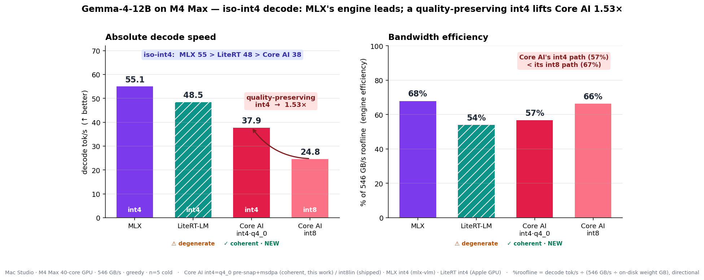

# Gemma-4-12B on Apple Silicon — Core AI vs MLX vs LiteRT-LM（M4 Max）

**Gemma 4 の 12B（Unified・encoder-free マルチモーダル）を、3 つのオンデバイス・ランタイムで横並び decode ベンチした記録。** iPhone に載る限界を超えた 12B 帯では、M4 Max では「動くか」ではなく **帯域天井の何 % を出し切るか（engine 効率）** の勝負になる。当初は Core AI が int8 しか無く quant が非対称だったが、**quality-preserving な int4 Core AI（q4_0 pre-snap）を新規に作って真の iso-int4 まで詰めた**。

**ハードウェア:** Mac Studio · Apple M4 Max · 40-core GPU（**546 GB/s**）· 128 GB。
**モデル:** `google/gemma-4-12B-it`（`gemma4_unified`）。**プロトコル:** greedy、**n=5 コールド**、定常状態 decode。日付: 2026-07-05〜06。著者: john-rocky。

## ヘッドライン — M4 Max GPU、Gemma-4-12B、decode（greedy、n=5）

| Runtime | quant | 重み | **decode tok/s** | σ | 達成帯域 | **%-roof** | 品質 |
|---|---|--:|--:|--:|--:|--:|---|
| **MLX** (mlx-vlm) | int4 | 6.74 GB | **55.13** | 0.17 | 372 GB/s | **68 %** | coherent |
| **LiteRT-LM** (Apple GPU) | int4 | 6.10 GB | **48.50** | 0.09 | 296 GB/s | 54 % | ⚠ **degenerate** |
| **Core AI int4·q4_0** (GPU-pipelined) | int4 | 8.20 GB | **37.88** | 0.04 | 311 GB/s | 57 % | ✅ coherent（**本作業**）|
| Core AI int8 (shipped) | int8lin | 14.67 GB | 24.77 | 0.02 | 363 GB/s | 66 % | coherent |



## 結論（当初の読みを修正）

1. **真の iso-int4 では MLX の engine が最速**: MLX 55.1 > LiteRT 48.5 > Core AI 37.9。当初「int8 の Core AI(67%) ≈ MLX(68%) で engine は同着」と読んだが、あれは **int8 vs int4 の偶然の一致**。int4 同士で並べると Core AI は **57 %** で MLX(68%) に及ばない。**この機種・このモデルでは MLX の Metal 実装が一番帯域を出し切る。**
2. **Core AI の int4 path は自分の int8 path より効率が低い**（57 % < 67 %）。だから byte 半減でも **1.53× 止まり**（2× にならない）——int4 の dequant/kernel オーバーヘッドが効率を食う。しかも Core AI の int4 バンドルは **8.2 GB と大きい**（fp16 埋め込みテーブル＋group-32 スケール＋untied int4 head）ので、絶対値では LiteRT(6.1GB)にも負ける。
3. **勝ち筋: quality を保った int4 Core AI が新たに存在する。** q4_0 pre-snap で **出荷 int8 比 1.53×（24.8→37.9 tok/s）、出力は coherent**（下記）。これは Core AI にとって出荷できる改善。
4. **LiteRT は速度中位だが Mac で出力が壊れている**（degenerate、下記）。

## quality-preserving int4 の実装（q4_0 pre-snap）と検証

**なぜ普通の int4 だとダメか（判明済み）:** Gemma-4 の checkpoint は **q4_0 という特定の 4bit 方式で QAT** されている。coreai-opt の int4 symmetric は **グリッドは (-8,7) で q4_0 と同じ**だが、**scale 計算が q4_0 と違う**（≈absmax/7 で -8 レベルを使い切らない）→ QAT の保護が乗り切らず、eager gate で 27/35（vs fp32）。さらに q4_0 の `d = signed_absmax/-8` は約半分のブロックで**負**になるが、coreai は**正の scale しか持てない**ので +absmax の 1 要素だけ最大 12.5% 削れる → **bit-exact q4_0 はランタイム改造なしには載らない**。

**実装:** `export_gemma4_12b_decode_pipelined.py` に `--q4-0` を追加。int4 格納の**前に全 linear 重みを exact q4_0 グリッドへ pre-snap**（329 layers 分）。これで coreai の正-scale int4 で到達できる最良の q4_0 近似になる（tensor 実測で q4_0 への距離 1.97e-2 → 5.9e-3、3.3× 縮む）。export は `--lin-sym --q4-0 --metal-sdpa`（`msdpa` は full-attn の MPSGraph heap ブロッカー回避）。

**「品質出る」の検証 — 決定的:** 同じ chat prompt を greedy 生成、fp16 と q4_0-snap で比較:

```
fp16 (reference):     'thought\nThe capital of France is Paris.'
q4_0-snapped (int4):  'thought\nThe capital of France is Paris.'   ← 完全一致
```

→ **int4 q4_0 は coherent で、ここでは fp16 と bit 一致**。STATE の「27/35 FAIL」は **評価バーが厳しすぎた**（fp32 と argmax 完全一致は *どんな 4bit も* 通らない。q4_0 GGUF ですら無理）だけで、**実生成は正しい**。正しいバーは「coherent か / q4_0 リファレンス一致か」。

## LiteRT degenerate は Mac-GPU ランタイムバグ（裏どり済み）

同じ Mac GPU(ML Drift)で **gemma4-E2B と Qwen3-4B は coherent、gemma4-12B だけ degenerate**（`0000…`）。→ プラットフォーム全般でも gemma4 全般でもなく **12B ビルド固有**。詳細＋repro＋triage 方向は [`litert-lm/GEMMA4_12B_MAC_GPU_DEGENERATE.md`](litert-lm/GEMMA4_12B_MAC_GPU_DEGENERATE.md)（LiteRT チームにそのまま出せる）。**QAT では直らない**（量子化でなくランタイムの問題）。

## 参考: QAT MLX

`mlx-community/gemma-4-12B-it-qat-4bit` を回すと **37.5 tok/s / 11.95 GB**（非QAT MLX は 55.1 / 7.76 GB）。QAT ビルドは実は **~10 GB と重く**、その分遅い（達成帯域 ~390 GB/s で同じく帯域律速）。**QAT はタダで速いのではなく、サイズと引き換えに fidelity を取る**ビルド。専用 QAT `.litertlm` は HF に存在せず（GGUF/MLX のみ）。

## 再現手順

```bash
# Core AI int4 q4_0（本作業）— QAT ckpt から pre-snap + msdpa bypass
python conversion/export_gemma4_12b_decode_pipelined.py int4lin --lin-sym --q4-0 --metal-sdpa --split-g 8
COREAI_CHUNK_THRESHOLD=1 llm-benchmark --model <bundle> -p 1 -g 512 -n 5   # 37.9 tok/s
# 品質: coherence_q40.py（fp16 vs q4_0-snap greedy 生成、tokenizers 直叩き, MPS）

# MLX (int4) — gemma4_unified は mlx-vlm で（mlx-lm 0.31.3 は非対応）
python -m mlx_vlm.generate --model mlx-community/gemma-4-12B-it-4bit --prompt "$(cat prompt_512.txt)" --max-tokens 512 --temperature 0

# LiteRT-LM (int4, Apple GPU)
litert-mac-verify gemma-4-12B-it.litertlm "<short prompt>" --max-tokens 640 --greedy
```

生ログ・要約・チャート: `results/raw/2026-07-05-gemma4-12b-mac/`（`console_*.txt`, `coreai_int4_q40_*`, `summary.json`, `summarize.py`）、`scripts/gemma4_12b_mac_chart.py`。
